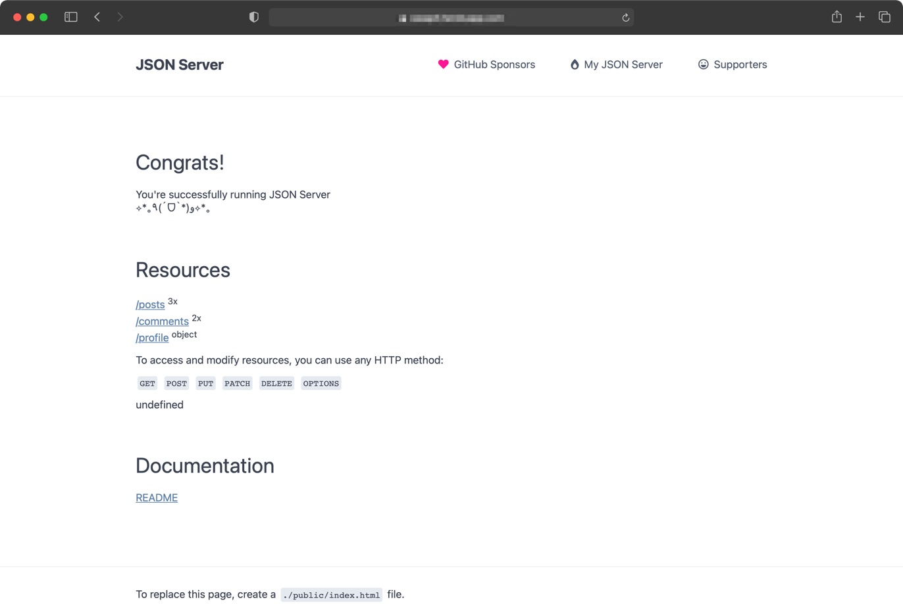
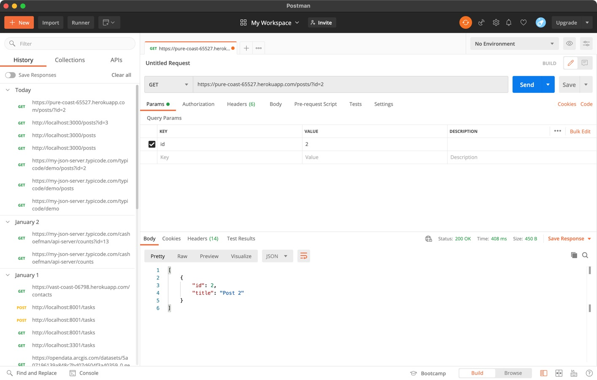

# My-Heroku-API-Server

[Previously](https://github.com/cashoefman/my-api-server) we created an online JSON API Server online and locally. This time we are going to do the same thing but we will be deploying it to [Heroku](https://heroku.com) instead.

The steps for this are fairly simple. First clone the repo below to your favorite project directory on your computer.
```
git clone https://github.com/cashoefman/my-heroku-api-server.git'
```
Like before you can now update the db.json file to your liking or just use the demo db.json that I provided to get started.

Next, if you do not already have one, you need to create an account on [Heroku](https://heroku.com/), it is free and create a new project on heroku. 

In order to create the project you need to have the Heroku CLI. You can install it by following the instructions [here](https://devcenter.heroku.com/articles/heroku-cli). Or, if you have brew installed on a MAC it is easy, just run `brew tap heroku/brew && brew install heroku`.

Then we are ready to create the project on Heroku and deploy the code. In order to do so, in your project directory, run:
```
heroku create
git push heroku main
```
You can add a project name if you want (ie. `heroku create casssupercooljsonapisever`). It will take a few seconds to complete but, once it is done you can run `heroku open` and a browser window will magically appear and you are ready to start using your brand new JSON API Server!



Just like before, you can use postman to quickly test out your new API!



